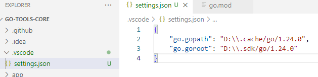

# Extension for [SDKM](https://github.com/itbasis/sdkm) support in VSCode

> Tip: Currently only support for setting environment variables for Go has been added.

## Features

When opening a Go project, paths will be calculated and written in `settings.json`:

## Requirements

Requires [SDKM](https://github.com/itbasis/sdkm) to be pre-installed and available in env.PATH

## Install

At the moment, installation is only via [vsix file](https://github.com/itbasis/sdkm-vscode/releases/latest)

## Release Notes

see [ChangeLog](./CHANGELOG.md)
